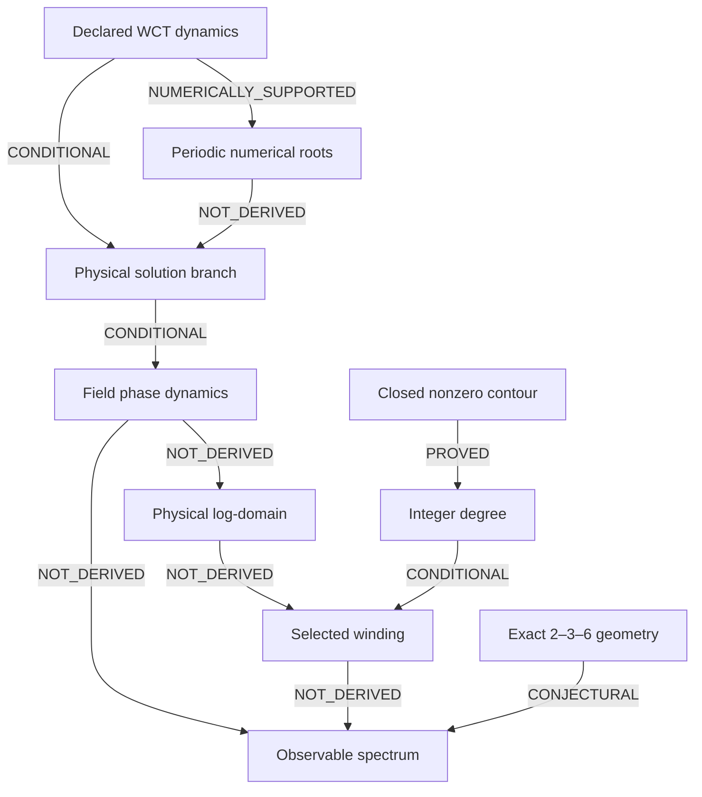

# Foundational closure verdict

Audit date: 2026-10-07 UTC. Primary repository: `rickyjreyes/geometry_of_resonance`. Branch: `agent/wct-physical-domain-winding-derivation`. Base: `a0048ef751a8876a9494f6de24b952ebc1db7213`.

**Decision: `WCT_ACTIVE_DOMAIN_UNDERDETERMINED`.** This is a completed audit of the identified premises, not completion of the physical theory. No independently specified physical domain, selected winding and measurement map jointly produce a prospective spectral prediction.

## Scope of the underdetermination result

The conclusion concerns the equations and bridge premises explicitly recorded in the [dynamics inventory](DYNAMICS_AND_SOURCE_INVENTORY.md), not every possible future WCT model or every uninspected manuscript. It is stronger than a failed literature search: D1 exhibits a continuous radius degeneracy in the published locking problem; D2 gives exact solutions on continuously variable externally supplied domains; D3 proves a spreading obstruction for the specified positive free-space energies; O1 gives different measurement completions of the same field; O2 disproves the equality of mean phase gradient and fitted frequency under closure alone.

Together these counterexamples show that the claimed inference from the present closure/geometry/PDE premises to a unique observable domain and frequency is invalid. They do not prove that a particular fully specified stable localized branch of the corrected action can never exist. Even a future uniqueness theorem for such a spatial branch would still need the presently undefined observable-domain and measurement functionals. No arbitrary closure axiom is adopted to bridge that gap.

## A. Mathematical status

Established or conditionally established: complex-safe denominator positivity; a formal corrected Euler–Lagrange equation; meaningful field phase away from zeros; integer degree on a closed nonzero contour; the fixed-geometry, fixed-sector locking minimizer; exact 2–3–6 finite-dimensional identities; and the coordinate/covariance lemmas with their premises stated.

New audit deductions are separated in [prior_vs_new.json](../audit/physical_domain/prior_vs_new.json): continuous locking-radius degeneracy; extension of the positive-energy spreading obstruction to corrected spatial energies; the conditional nearest-integer sector rule and its dynamical obstruction; a physical-clock compatibility counterexample for simultaneous PFF continuity and gradient flow; and an exact least-squares counterexample. All 30 symbolic checks pass. They verify written algebra and explicit examples, not full nonlinear stability or a new Lean formalization.

## Dependency graph

Every arrow is scoped in [dependency_graph.json](../audit/physical_domain/dependency_graph.json). The field-phase calculation is exact for a smooth nonzero solution of the specified model; the existence and selection of the required physical branch remain additional premises. Numerical roots support their own finite periodic problem. They do not establish the required physical branch.

## B. Physical active-domain result

`PHYSICAL_ACTIVE_DOMAIN_NOT_DERIVED`. Locking allows every circular radius. Positive spatial energies alone lack a free-space fixed-mass ground state in the stated class. The Willmore minimum selects a shape ratio but leaves homothety free. A spatial cavity boundary can be supplied independently, but that still does not define endpoints in a measured log variable. The minimum missing input is a physical binding/interface/preparation problem selecting a set, plus its independently defined map into x and endpoint matching.

## C. Winding selection

Predictive classification: `NOT_IDENTIFIABLE`. The published phase minimizer is `CONDITIONAL_ON_BOUNDARY_DATA`. If one adds global minimization over accessible sectors and assumes the locking term is the entire sector-dependent energy, the minimizing integers are nearest to `(integral sigma ds+m Phi_Omega)/(2pi)`, with a two-way tie at half-integers. This is a conditional lemma, not a derived physical branch set. Smooth phase-only evolution conserves its initial winding; a phase-slip or boundary-injection law is missing. The falsifier for the explicitly unadopted sector-relaxation hypothesis is stated in the winding report.

## D. Observable correspondence

`SPECTRAL_MEASUREMENT_MAP_NOT_DERIVED`. For `phi(ell)=2pi ell+epsilon ell(1-ell)(ell-1/2)` on [0,1], closure gives mean gradient exactly 2pi, while local least-squares fitting with free amplitude and phase gives `k_fit=2pi+0.160044729544955... epsilon+O(epsilon^2)`. The discrepancy exists without noise, gaps or detector smearing. An actual source observable, response, coordinate map and estimator theorem are required.

## E. 2–3–6 geometry

The identities are exact. The lift gain sqrt(6) is a singular value of a map from R to R^3, not a physical evolution eigenvalue. A hypothetical root-mass dilation sqrt(6) implies mass dilation 6. The reviewed material does not derive either as an autonomous physical dilation. Geometric normalizations, physical operator claims, structural analogies and retrospective comparisons are kept distinct in the operator audit.

## F. PDE consistency and preserved evidence

| Asset | What the inspected evidence supports | What it does not close |
|---|---|---|
| Corrected action, S004 | Real complex-field action and flat-background formal variation | Physical clock, admissible higher-derivative modes, selected nonzero background, localization and reduction to the implemented rails |
| Polynomial Hamiltonian PDE, S011/S044 | Conservation; global H2 well-posedness argument in d<=3; accurate fixed-periodic-domain stationary roots | Intrinsic boundaries, unique stable localized branch and physical spectrum |
| Closure suite, S044/S047 | Preserved failure of the frozen route, with distinct numerical and analytical causes | No all-parameter nonexistence theorem; no retrospective promotion of failed gates |
| D4 refinement, S045/S046 | A pending record with missing original reference arrays | Temporal/continuum/all-time stability certification; inaccessible later results are not inferred |
| Topology convergence, S048 | Parent verdict `NO_VALIDATED_TOPOLOGICAL_SPECTRAL_SELF_BINDING` remains intact | Revised failure semantics do not establish self-binding |
| FEM, S020/S021/S031–S033 | Independent declared discretizations and explicit projection provenance | A physical domain/winding/measurement triple |
| Julia/SymPy, S022–S027/S034–S036 | Encoded symbolic models, finite-band identities and parameter non-identifiability | An independently fixed physical scale or universal operator equivalence |
| Lean, S013–S019/S028–S030 | Algebraic theorems and declared analytic contracts | Full PDE existence/stability derived from first principles; this audit did not rerun Lean |
| PERIODIC/eigen/mass, S037–S042 | A positive-energy obstruction, explicit source-coupled assumptions, candidate validation gates | Gates alone do not show a physical candidate passed or generate the missing observable map |

The inventory treats M0–M5 as distinct models. A real scalar gradient field, a complex Hamiltonian rail and a fourth-order corrected action cannot silently share phase, clock, conservation or stability claims.

## G. Prediction

No quantitative physical prediction is issued. [prediction.json](../audit/physical_domain/prediction.json) leaves x, W, L_W, n_W, mean frequency and observable mapping null. The conditional covariance and uncertainty formulas are retained without numerical instantiation. No empirical fitted frequency, new PDE simulation, collider evaluation or final ATLAS holdout was used.

## H. Remaining obligations, ranked

The downstream counts below count the five named target assets (physical solution, domain, winding, spectrum and covariance), not repository files or completion percentages. Likelihood labels are qualitative judgments about the inspected evidence, not numerical probabilities.

| Rank | Minimum obligation | Foundational role / downstream targets | Prospect using existing evidence | Additional compute |
|---|---|---|---|---|
| 1 | Fix one consistent physical dynamics and derive its selected background, units and justified reduction | Defines the solution problem; affects all 5 targets | Moderate for a decisive linearized result; no existing full reduction is supplied | Symbolic action expansion and small matrix algebra |
| 2 | Prove binding/interface or independently measured boundary selection and map the physical set into x | Removes continuous size/domain ambiguity; affects domain, winding, spectrum, covariance (4) | Low for full closure from preserved simulations; analytic obstructions already decisive for some energies | Analysis first; simulation only after a concrete branch and observable are specified |
| 3 | Derive full sector energy and preparation/phase-slip selection law, including holonomy | Distinguishes quantization from chosen integer; affects winding, spectrum, covariance (3) | Moderate for fixed-geometry reductions; low for full dynamical selection from current records | Symbolic reduction; later targeted stability work if justified |
| 4 | Derive measurement response and controlled phase-to-estimator correspondence | Makes the result experimentally meaningful; affects spectrum and covariance (2) | Low from current field-only material; requires physical measurement specification | Analytic response/estimator calculation; no collider scan needed |

These are obligations, not four parallel task recommendations. The next authorized research proposal is the single task below.

## I. Exact decision

`WCT_ACTIVE_DOMAIN_UNDERDETERMINED`

The frozen ATLAS audit at `af6da1f5cfdc0a6a685c79309db342dd2338aae9` remains unchanged. `NO_GO_FOR_NEW_ATLAS_RUN` and `ACTIVE_DOMAIN_PROTOCOL_NOT_IDENTIFIABLE` remain in force; V6.1 is not reopened. Research completion scores and unresolved issue states are unchanged.

## J. Exactly one next research task

**Derive the complete quadratic action and dispersion about an independently specified nonzero background of the corrected complex-safe WCT action S004.** Keep the physical clock and units explicit, include every amplitude/phase and higher-time-derivative mode, and determine whether a controlled admissible branch supplies a finite spatial band without importing a phenomenological rail or fitting observed peaks. Background and coupling freedom must remain explicit; do not choose them to obtain a desired scale.

Scientific value: this tests the earliest unresolved link between the foundational action and the dynamics currently used to argue for confinement. Estimated effort: 2–5 focused research days, a planning judgment contingent on the available background specification. Success: a complete mode analysis with justified physical branch/units and independent coefficient provenance, or a rigorous obstruction for the declared class. Failure to close: the band or acceptable branch requires an arbitrary background, undetermined couplings, an unexplained clock change, or a discarded mode without a controlled argument. Preserve underdetermination in that case. Compute: symbolic differentiation and small matrix checks are justified; no large PDE simulation or new collider analysis is justified.

## Reproduction and preservation

Start with [REPRODUCE.md](../audit/physical_domain/REPRODUCE.md), [SOURCE_LEDGER.json](../audit/physical_domain/SOURCE_LEDGER.json) and [VALIDATION.json](../audit/physical_domain/VALIDATION.json). The five requested reports, additional dynamics inventory, machine records and symbolic script are additions on an isolated branch. Baseline blobs are preserved and no scientific registry is edited. Exact final Git provenance is the commit containing these files; publication verification is supplied separately after the branch update to avoid a self-referential commit hash.
